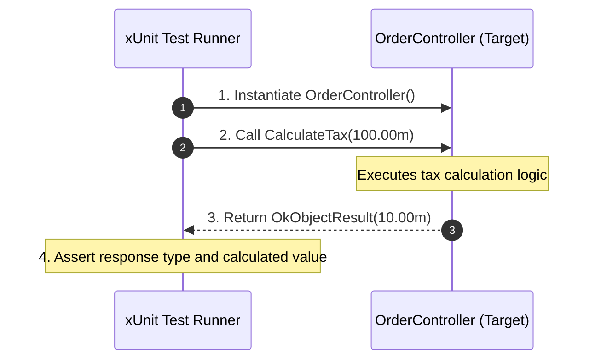
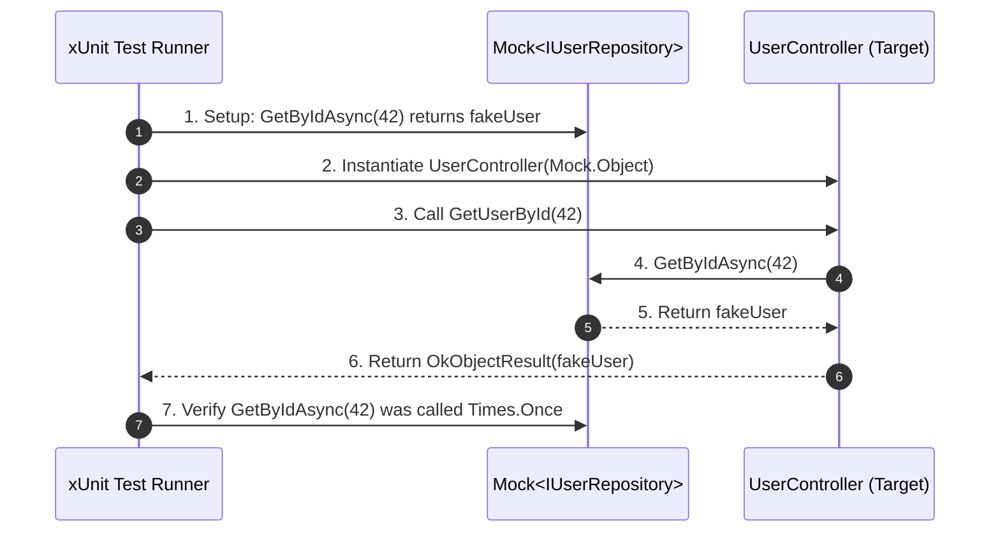

## Part 1: xUnit Testing Fundamentals
**xUnit.net** is the leading open-source unit testing tool for .NET.

- Testing means checking that your code works correctly before it goes live.
- Unit Testing = testing the smallest part of code (a method, service, or controller action) alone, without other parts.
- Why? Finds bugs early, keeps code quality high, makes refactoring safe.

### Key Attributes & Concepts

* **`[Fact]`**: Identifies a test method that requires no parameters and tests a fixed condition.
* **`[Theory]`**: Identifies a test method that accepts arguments to test the same logic across multiple data variations.
* **`[InlineData]`**: Passes primitive data arguments to a `[Theory]` method.
* **AAA Pattern (Arrange, Act, Assert)**:
  1. **Arrange**: Initialize target objects, setup input data.
  2. **Act**: Execute the method under test.
  3. **Assert**: Verify that outcomes match expected criteria using `Assert` class methods.
---
- When testing a controller or service with no external dependencies, xUnit acts directly upon the target instance:



---

### Production Code Example: Controller Without Dependencies

```csharp
using Microsoft.AspNetCore.Mvc;

namespace MyWebAPI.Controllers;

[ApiController]
[Route("api/[controller]")]
public class OrderController : ControllerBase
{
    [HttpGet("calculate-tax")]
    public IActionResult CalculateTax(decimal orderTotal)
    {
        if (orderTotal <= 0)
        {
            return BadRequest("Order total must be greater than zero.");
        }

        // Standard 10% tax calculation
        decimal tax = orderTotal * 0.10m;
        return Ok(tax);
    }
}
```

---
### xUnit Test Suite

```csharp
using Microsoft.AspNetCore.Mvc;
using MyWebAPI.Controllers;
using Xunit;

namespace MyWebAPI.Tests;

public class OrderControllerTests
{
    [Fact]
    public void CalculateTax_WhenOrderTotalIsPositive_ReturnsOkWithCalculatedTax()
    {
        // 1. ARRANGE
        var controller = new OrderController();
        decimal inputTotal = 100.00m;
        decimal expectedTax = 10.00m;

        // 2. ACT
        var result = controller.CalculateTax(inputTotal);

        // 3. ASSERT
        var okResult = Assert.IsType<OkObjectResult>(result); 
        var actualTax = Assert.IsType<decimal>(okResult.Value); 
        Assert.Equal(expectedTax, actualTax);
    }

    [Theory]
    [InlineData(0)]
    [InlineData(-10.50)]
    [InlineData(-100)]
    public void CalculateTax_WhenOrderTotalIsZeroOrNegative_ReturnsBadRequest(decimal invalidTotal)
    {
        // ARRANGE
        var controller = new OrderController();

        // ACT
        var result = controller.CalculateTax(invalidTotal);

        // ASSERT
        var badRequestResult = Assert.IsType<BadRequestObjectResult>(result);
        Assert.Equal("Order total must be greater than zero.", badRequestResult.Value);
    }
}
```
---
## 3. Part 2: Moq Testing (Dependency Mocking)

Real-world API controllers rarely work in isolation. They depend on services, repositories, databases, and third-party HTTP clients via Dependency Injection (DI).

When unit testing, you do not want to hit a real database or call a live API endpoint. Moq is a library that allows you to create dummy "mock" implementations of interfaces. You can program these mocks to return specific responses or throw errors when called..

### Core Moq Concepts

* **`new Mock<IInterface>()`**: Creates a fake instance of an interface or abstract class T.
* **`.Setup(...)`**: Defines how a method on the mock should behave when called.
* **`.ReturnsAsync(...)` / `.Returns(...)`**: Specifies the value the mocked method should return.
* **`It.IsAny<T>()`**: Serves as a parameter wildcard matcher.
* **`.Verify(...)`**: Asserts that a specific method on the mock was actually called a specific number of times.
---
When testing components with external dependencies (e.g., Repositories, Databases, Third-party APIs), **Moq** intercepts dependency calls so the database or network is never touched.


---

### Production Code Example: Controller With Dependencies

```csharp
// Models & Interfaces
namespace MyWebAPI.Models;

public class UserProfile
{
    public int Id { get; set; }
    public string Name { get; set; } = string.Empty;
    public string Email { get; set; } = string.Empty;
}

public interface IUserRepository
{
    Task<UserProfile?> GetByIdAsync(int id);
    Task<bool> CreateUserAsync(UserProfile user);
}

// Controller Implementation
using Microsoft.AspNetCore.Mvc;
using MyWebAPI.Models;

namespace MyWebAPI.Controllers;

[ApiController]
[Route("api/[controller]")]
public class UserController : ControllerBase
{
    private readonly IUserRepository _userRepository;

    public UserController(IUserRepository userRepository)
    {
        _userRepository = userRepository;
    }

    [HttpGet("{id}")]
    public async Task<IActionResult> GetUserById(int id)
    {
        var user = await _userRepository.GetByIdAsync(id);

        if (user == null)
        {
            return NotFound($"User with ID {id} was not found.");
        }

        return Ok(user);
    }
}
```

---
