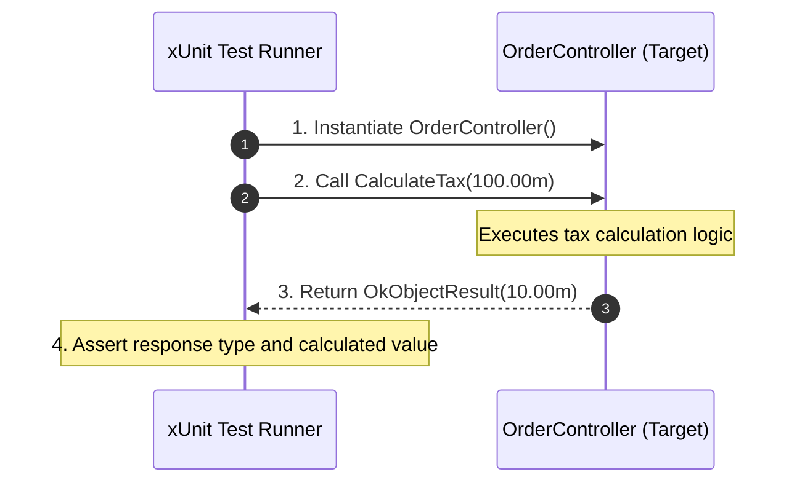
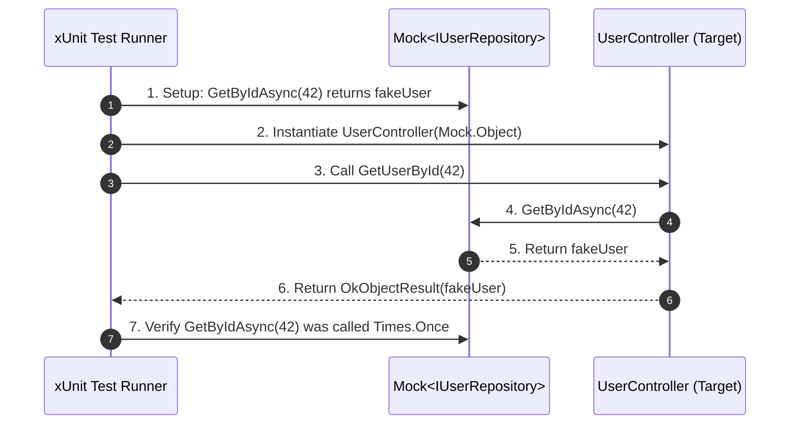

## Part 1: xUnit Testing Fundamentals
**xUnit.net** is the leading open-source unit testing tool for .NET.

- Testing means checking that your code works correctly before it goes live.
- Unit Testing = testing the smallest part of code (a method, service, or controller action) alone, without other parts.
- Why? Finds bugs early, keeps code quality high, makes refactoring safe.

### Key Attributes & Concepts

* **`[Fact]`**: Identifies a test method that requires no parameters and tests a fixed condition.
* **`[Theory]`**: Identifies a test method that accepts arguments to test the same logic across multiple data variations.
* **`[InlineData]`**: Passes primitive data arguments to a `[Theory]` method.
* **AAA Pattern (Arrange, Act, Assert)**:
  1. **Arrange**: Initialize target objects, setup input data.
  2. **Act**: Execute the method under test.
  3. **Assert**: Verify that outcomes match expected criteria using `Assert` class methods.
---
- When testing a controller or service with no external dependencies, xUnit acts directly upon the target instance:



---

### Production Code Example: Controller Without Dependencies

```csharp
using Microsoft.AspNetCore.Mvc;

namespace MyWebAPI.Controllers;

[ApiController]
[Route("api/[controller]")]
public class OrderController : ControllerBase
{
    [HttpGet("calculate-tax")]
    public IActionResult CalculateTax(decimal orderTotal)
    {
        if (orderTotal <= 0)
        {
            return BadRequest("Order total must be greater than zero.");
        }

        // Standard 10% tax calculation
        decimal tax = orderTotal * 0.10m;
        return Ok(tax);
    }
}
```

---
### xUnit Test Suite

```csharp
using Microsoft.AspNetCore.Mvc;
using MyWebAPI.Controllers;
using Xunit;

namespace MyWebAPI.Tests;

public class OrderControllerTests
{
    [Fact]
    public void CalculateTax_WhenOrderTotalIsPositive_ReturnsOkWithCalculatedTax()
    {
        // 1. ARRANGE
        var controller = new OrderController();
        decimal inputTotal = 100.00m;
        decimal expectedTax = 10.00m;

        // 2. ACT
        var result = controller.CalculateTax(inputTotal);

        // 3. ASSERT
        var okResult = Assert.IsType<OkObjectResult>(result); 
        var actualTax = Assert.IsType<decimal>(okResult.Value); 
        Assert.Equal(expectedTax, actualTax);
    }

    [Theory]
    [InlineData(0)]
    [InlineData(-10.50)]
    [InlineData(-100)]
    public void CalculateTax_WhenOrderTotalIsZeroOrNegative_ReturnsBadRequest(decimal invalidTotal)
    {
        // ARRANGE
        var controller = new OrderController();

        // ACT
        var result = controller.CalculateTax(invalidTotal);

        // ASSERT
        var badRequestResult = Assert.IsType<BadRequestObjectResult>(result);
        Assert.Equal("Order total must be greater than zero.", badRequestResult.Value);
    }
}
```
---
## 3. Part 2: Moq Testing (Dependency Mocking)

Real-world API controllers rarely work in isolation. They depend on services, repositories, databases, and third-party HTTP clients via Dependency Injection (DI).

When unit testing, you do not want to hit a real database or call a live API endpoint. Moq is a library that allows you to create dummy "mock" implementations of interfaces. You can program these mocks to return specific responses or throw errors when called..

### Core Moq Concepts

* **`new Mock<IInterface>()`**: Creates a fake instance of an interface or abstract class T.
* **`.Setup(...)`**: Defines how a method on the mock should behave when called.
* **`.ReturnsAsync(...)` / `.Returns(...)`**: Specifies the value the mocked method should return.
* **`It.IsAny<T>()`**: Serves as a parameter wildcard matcher.
* **`.Verify(...)`**: Asserts that a specific method on the mock was actually called a specific number of times.
---
When testing components with external dependencies (e.g., Repositories, Databases, Third-party APIs), **Moq** intercepts dependency calls so the database or network is never touched.


---

### Production Code Example: Controller With Dependencies

```csharp
// Models & Interfaces
namespace MyWebAPI.Models;

public class UserProfile
{
    public int Id { get; set; }
    public string Name { get; set; } = string.Empty;
    public string Email { get; set; } = string.Empty;
}

public interface IUserRepository
{
    Task<UserProfile?> GetByIdAsync(int id);
    Task<bool> CreateUserAsync(UserProfile user);
}

// Controller Implementation
using Microsoft.AspNetCore.Mvc;
using MyWebAPI.Models;

namespace MyWebAPI.Controllers;

[ApiController]
[Route("api/[controller]")]
public class UserController : ControllerBase
{
    private readonly IUserRepository _userRepository;

    public UserController(IUserRepository userRepository)
    {
        _userRepository = userRepository;
    }

    [HttpGet("{id}")]
    public async Task<IActionResult> GetUserById(int id)
    {
        var user = await _userRepository.GetByIdAsync(id);

        if (user == null)
        {
            return NotFound($"User with ID {id} was not found.");
        }

        return Ok(user);
    }
}
```

---
### xUnit + Moq Test Suite

```csharp
using Microsoft.AspNetCore.Mvc;
using Moq;
using MyWebAPI.Controllers;
using MyWebAPI.Models;
using Xunit;

namespace MyWebAPI.Tests;

public class UserControllerTests
{
    private readonly Mock<IUserRepository> _mockRepo;
    private readonly UserController _controller;

    public UserControllerTests()
    {
        // Shared Setup: Create mock repository and pass its Object to the target controller
        _mockRepo = new Mock<IUserRepository>();
        _controller = new UserController(_mockRepo.Object);
    }

    [Fact]
    public async Task GetUserById_WhenUserExists_ReturnsOkWithUser()
    {
        // ARRANGE
        int userId = 42;
        var fakeUser = new UserProfile { Id = userId, Name = "Jane Doe", Email = "jane@example.com" };

        _mockRepo.Setup(repo => repo.GetByIdAsync(userId))
                 .ReturnsAsync(fakeUser);

        // ACT
        var result = await _controller.GetUserById(userId);

        // ASSERT
        var okResult = Assert.IsType<OkObjectResult>(result);
        var returnedUser = Assert.IsType<UserProfile>(okResult.Value);
        
        Assert.Equal(userId, returnedUser.Id);
        Assert.Equal("Jane Doe", returnedUser.Name);

        // VERIFY: Verify repository was queried exactly once
        _mockRepo.Verify(repo => repo.GetByIdAsync(userId), Times.Once);
    }

    [Fact]
    public async Task GetUserById_WhenUserDoesNotExist_ReturnsNotFound()
    {
        // ARRANGE
        int userId = 99;

        _mockRepo.Setup(repo => repo.GetByIdAsync(It.IsAny<int>()))
                 .ReturnsAsync((UserProfile?)null);

        // ACT
        var result = await _controller.GetUserById(userId);

        // ASSERT
        var notFoundResult = Assert.IsType<NotFoundObjectResult>(result);
        Assert.Equal("User with ID 99 was not found.", notFoundResult.Value);

        // VERIFY
        _mockRepo.Verify(repo => repo.GetByIdAsync(99), Times.Once);
    }
}
```
---

**Mocking Async Repository with Exceptions**, **Mocking `ILogger**`, and **Testing `HttpPost` / Validation**.

## Scenario 1: Testing Exception Handling & Database Failures

When your repository throws a database exception or connection error, your API controller should handle it gracefully (e.g., returning a `500 Internal Server Error`).

### Production Code

```csharp
using Microsoft.AspNetCore.Mvc;

namespace MyWebAPI.Controllers;

[ApiController]
[Route("api/[controller]")]
public class ProductsController : ControllerBase
{
    private readonly IProductRepository _repository;

    public ProductsController(IProductRepository repository)
    {
        _repository = repository;
    }

    [HttpGet("{id}")]
    public async Task<IActionResult> GetProduct(int id)
    {
        try
        {
            var product = await _repository.GetByIdAsync(id);
            if (product == null) return NotFound();
            return Ok(product);
        }
        catch (Exception)
        {
            return StatusCode(500, "An error occurred while fetching the product.");
        }
    }
}

```

### xUnit + Moq Test (`.ThrowsAsync`)

Using `.ThrowsAsync()`, you force the mock to simulate a database failure without having an actual database connection.

```csharp
using Microsoft.AspNetCore.Mvc;
using Moq;
using MyWebAPI.Controllers;
using Xunit;

namespace MyWebAPI.Tests;

public class ProductsControllerTests
{
    [Fact]
    public async Task GetProduct_WhenDatabaseThrowsException_Returns500InternalServerError()
    {
        // ARRANGE
        var mockRepo = new Mock<IProductRepository>();
        
        // Setup mock to throw an exception when GetByIdAsync is called
        mockRepo.Setup(repo => repo.GetByIdAsync(It.IsAny<int>()))
                .ThrowsAsync(new Exception("Database connection timeout"));

        var controller = new ProductsController(mockRepo.Object);

        // ACT
        var result = await controller.GetProduct(10);

        // ASSERT
        var statusResult = Assert.IsType<ObjectResult>(result);
        Assert.Equal(500, statusResult.StatusCode);
        Assert.Equal("An error occurred while fetching the product.", statusResult.Value);
    }
}

```

---

## Scenario 2: Testing POST Endpoint & Object Creation

In a `POST` method, controllers usually validate input, pass models to a repository, and return a `201 CreatedAtAction` response.

### Production Code

```csharp
using Microsoft.AspNetCore.Mvc;
using MyWebAPI.Models;

namespace MyWebAPI.Controllers;

[ApiController]
[Route("api/[controller]")]
public class ProductsController : ControllerBase
{
    private readonly IProductRepository _repository;

    public ProductsController(IProductRepository repository) => _repository = repository;

    [HttpPost]
    public async Task<IActionResult> CreateProduct([FromBody] ProductDto dto)
    {
        if (string.IsNullOrWhiteSpace(dto.Name))
        {
            return BadRequest("Product name is required.");
        }

        var newProduct = new Product { Id = 101, Name = dto.Name, Price = dto.Price };
        await _repository.AddAsync(newProduct);

        // Returns 201 Created with Location header pointing to GetProduct
        return CreatedAtAction(nameof(GetProduct), new { id = newProduct.Id }, newProduct);
    }
}

```

### xUnit + Moq Test (Verifying Parameters with `It.Is`)

```csharp
using Microsoft.AspNetCore.Mvc;
using Moq;
using MyWebAPI.Controllers;
using MyWebAPI.Models;
using Xunit;

namespace MyWebAPI.Tests;

public class CreateProductTests
{
    [Fact]
    public async Task CreateProduct_WithValidData_Returns201CreatedAndCallsAddAsync()
    {
        // ARRANGE
        var mockRepo = new Mock<IProductRepository>();
        var controller = new ProductsController(mockRepo.Object);
        var inputDto = new ProductDto { Name = "Laptop", Price = 1200.00m };

        // ACT
        var result = await controller.CreateProduct(inputDto);

        // ASSERT
        var createdResult = Assert.IsType<CreatedAtActionResult>(result);
        Assert.Equal(201, createdResult.StatusCode);
        Assert.Equal("GetProduct", createdResult.ActionName);

        // VERIFY: Ensure AddAsync was called with a Product object matching our criteria
        mockRepo.Verify(repo => repo.AddAsync(It.Is<Product>(p => p.Name == "Laptop" && p.Price == 1200.00m)), Times.Once);
    }
}

```

---

## Scenario 3: Testing Log Calls (`ILogger<T>`)

Almost every enterprise Web API injects `ILogger<T>`. Verifying whether error logs or info logs were triggered requires matching Moq with extension methods.

### Production Code

```csharp
using Microsoft.AspNetCore.Mvc;
using Microsoft.Extensions.Logging;

namespace MyWebAPI.Controllers;

[ApiController]
[Route("api/[controller]")]
public class AuditController : ControllerBase
{
    private readonly ILogger<AuditController> _logger;

    public AuditController(ILogger<AuditController> logger)
    {
        _logger = logger;
    }

    [HttpPost("log-access")]
    public IActionResult LogAccess([FromBody] string username)
    {
        _logger.LogInformation("User {Username} accessed the audit endpoint.", username);
        return Ok();
    }
}

```

### xUnit + Moq Test (`ILogger` Verification)

Because `LogInformation` is an extension method, you mock the underlying `ILogger.Log` call:

```csharp
using Microsoft.AspNetCore.Mvc;
using Microsoft.Extensions.Logging;
using Moq;
using MyWebAPI.Controllers;
using Xunit;

namespace MyWebAPI.Tests;

public class AuditControllerTests
{
    [Fact]
    public void LogAccess_WhenCalled_LogsInformationMessage()
    {
        // ARRANGE
        var mockLogger = new Mock<ILogger<AuditController>>();
        var controller = new AuditController(mockLogger.Object);

        // ACT
        var result = controller.LogAccess("JohnDoe");

        // ASSERT
        Assert.IsType<OkResult>(result);

        // VERIFY: Check if ILogger.Log was executed with LogLevel.Information
        mockLogger.Verify(
            logger => logger.Log(
                LogLevel.Information,
                It.IsAny<EventId>(),
                It.Is<It.IsAnyType>((v, t) => v.ToString()!.Contains("User JohnDoe accessed")),
                It.IsAny<Exception>(),
                It.IsAny<Func<It.IsAnyType, Exception?, string>>()),
            Times.Once);
    }
}

```
